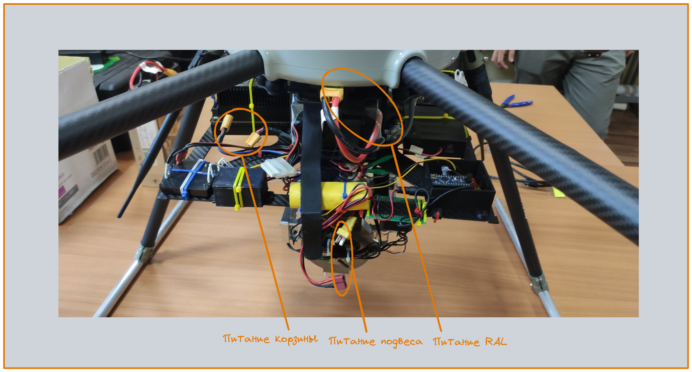

# demonstrator_uav

# Требования

**Ubuntu** не ниже 20.04

**Python3** не ниже 3.5

# Установка

Нужно поставить модули под python (ZMQ, Kivy, Crcmod):
```bash
pip3 install kivy[full] kivy-garden.mapview zmq crcmod
```

# Запуск
## Пульт для задачи маршрута

В папке `demonstrator_uav/gcs_application/scripts` нужно запустить файл:
```bash
python3 npu_app.py
```

## Планировщик прохождения по маршруту

В папке `demonstrator_uav/mission_planner` нужно заустить файл:
```bash
python3 mission_manager.py
```

## Модуль получении телеметрии с RAL

В папке `demonstrator_uav/RAL_bridge/scripts` нужно запустить файл:
```bash
python3 ral_telemetry.py
```

## Модуль получении отправки текущей целевой точки в RAL

В папке `demonstrator_uav/RAL_bridge/scripts` нужно запустить файл:
```bash
python3 ral_point.py
```

# Информация по дрону
## Адреса дронов
**RAL:**
| IP | ID |
| - | - |
| '192.168.166.12' | 2070360064 |
| '192.168.166.11' | 2120691968 |

## Протокол взаимодействия с RAL


# Включение системы RAL
## Подключение питания RAL


## Подключение компонентов связи с НСУ


# Подключение к бортовым блокам (корзина)

Чтобы зайти на Nx через SSH:
```bash
ssh nx1@<адрес дрона>
```
